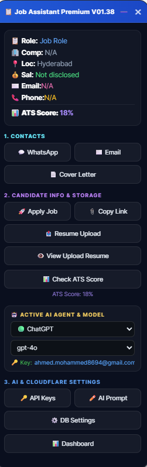

# 🚀 Job Assistant Premium (V01.41)
> **AI-Powered Job Application Assistant with Cloudflare D1 + R2 Storage & Google Gemini 1.5 Flash**

[](https://www.tampermonkey.net/)
[](https://aistudio.google.com/)
[](https://workers.cloudflare.com/)
[](https://www.cloudflare.com/)

**Job Assistant Premium** is an intelligent browser extension (Tampermonkey UserScript) designed to automate, personalize, and track your job application process across all major job portals. Powered by **Google Gemini 1.5 Flash AI**, it analyzes Job Descriptions in real-time against your uploaded resume to craft tailored, high-converting **Emails** and **WhatsApp messages**, while automatically tracking all details in a central database and rendering a premium dashboard.

---

## 📖 Table of Contents
1. [🌟 What is Job Assistant Premium?](#-what-is-job-assistant-premium)
2. [🎁 Key Benefits](#-key-benefits)
3. [🛠️ Step-by-Step Installation Guide](#%EF%B8%8F-step-by-step-installation-guide)
   - [Part 1: Installing & Configuring Tampermonkey](#part-1-installing--configuring-tampermonkey)
   - [Part 2: Setting up Your Own Cloudflare Backend (Workers, D1, R2)](#part-2-setting-up-your-own-cloudflare-backend-workers-d1-r2)
4. [🖥️ Application Features & Screenshot Walkthrough](#%EF%B8%8F-application-features--screenshot-walkthrough)
   - [1. Main Job Portal Control Panel](#1-main-job-portal-control-panel)
   - [2. Jobs Captured Details](#2-jobs-captured-details)
   - [3. Candidate Info & Storage](#3-candidate-info--storage)
   - [4. 🤖 Active AI Agent & Model](#4--active-ai-agent--model)
   - [5. AI & Cloudflare Settings](#5-ai--cloudflare-settings)
   - [6. Premium Analytics Dashboard](#6-premium-analytics-dashboard)
5. [🔧 Backend Technical Development](#-backend-technical-development)

---

## 🌟 What is Job Assistant Premium?
It is a dual-tier system consisting of a client-side **UserScript** overlaying major job portals (Naukri, LinkedIn, Indeed, etc.) and a serverless **Cloudflare Worker** acting as your private API server, database, and asset host.

### Who can use this?
* **Modern Job Seekers**: Who want to stand out by messaging HRs immediately after applying.
* **Relationship Managers & Customer Specialists**: The built-in templates are highly optimized for Customer Specialist/Relations domains, although it can be customized for any role.
* **Developers & Tech Professionals**: Looking to self-host their own job application database and resume files.

---

## 🎁 Key Benefits
* **🚀 Increase Response Rates**: Send highly relevant metrics-driven emails/messages to recruiters immediately after applying.
* **📂 100% Data Ownership**: Hosted completely on your personal Cloudflare serverless account. No third-party data collection.
* **📉 Zero Friction**: Double-click tracking automatically saves company name, role, salary, location, job description, custom templates, ATS score, and apply link to your database.
* **🧩 Context-Aware Signatures**: Extends your name, email, phone, and links straight from your parsed resume dynamically.

---

## 🛠️ Step-by-Step Installation Guide

### Part 1: Installing & Configuring Tampermonkey

#### 1. Add Tampermonkey to Your Browser
Install the official **Tampermonkey** browser extension for your browser:
* [Tampermonkey for Chrome / Edge / Brave / Opera](https://chrome.google.com/webstore/detail/tampermonkey/dhdgffkkebhmkfjojejmpbldmpobfkfo)
* [Tampermonkey for Firefox](https://addons.mozilla.org/en-US/firefox/addon/tampermonkey/)


#### 2. Create a New UserScript
1. Click the **Tampermonkey icon** in your browser toolbar and select **Dashboard**.


2. Click the **Utility / Add (+)** button to create a new script.
3. Clear any default code in the editor.
4. Open **[`job-assistant-userscript.user.js`](job-assistant-userscript.user.js)** from this repository, copy all the code, and paste it into the editor.
5. Press **`Ctrl + S`** (or select **File** ➔ **Save**) to save the script.


---

### Part 2: Setting up Your Own Cloudflare Backend (Workers, D1, R2)

To host your own database, custom resume uploads, and the application analytics dashboard:

#### 1. Create a Cloudflare Account
1. Visit **[dash.cloudflare.com](https://dash.cloudflare.com/)** and sign up for a free account.

#### 2. Create Workers & Pages Backend
1. Go to **Workers & Pages** in your sidebar.
2. Click **Create Application** ➔ **Create Worker**.
3. Name your worker `job-ai-backend`.
4. Deploy the basic worker.

#### 3. Create your D1 SQL Database
1. Go to **Workers & Pages** ➔ **D1 SQL Database**.
2. Click **Create Database** ➔ **D1 Database**.
3. Name your database `job-ai-db`.
4. Copy your generated **Database ID** (a long string like `5d6e5a34-b240-463a-a14a-519538fd2fc4`).
5. Open the **Console** tab of your D1 database dashboard and execute the SQL script in [schema.sql](schema.sql) to initialize the tables (`applications` and `user_api_keys`).

#### 4. Create your R2 Storage Bucket
1. Navigate to **R2 Object Storage** in your sidebar.
2. Click **Create Bucket**.
3. Name your bucket `jobassistantpremium`.
4. In bucket settings, enable the **Public R2.dev bucket URL** or bind your custom subdomain to ensure uploaded resumes can be viewed inline in the browser.

#### 5. Configure Wrangler in Your Local Codebase
Open **[`wrangler.jsonc`](wrangler.jsonc)** (or `wrangler.json` / `wrangler.toml`) in your editor and update it to match your database ID:
```json
{
  "name": "job-ai-backend",
  "main": "server.js",
  "compatibility_date": "2024-01-01",
  "d1_databases": [
    {
      "binding": "DB",
      "database_name": "job-ai-db",
      "database_id": "YOUR_DATABASE_ID_HERE"
    }
  ],
  "r2_buckets": [
    {
      "binding": "R2_BUCKET",
      "bucket_name": "jobassistantpremium"
    }
  ]
}
```

#### 6. Deploy the Backend Worker (Two Options)

##### Option A: Direct Terminal Deployment
Run these commands in your PowerShell or Bash terminal:
```bash
# Log in to your Cloudflare account
npx wrangler login

# Deploy your worker backend
npx wrangler deploy
```

##### Option B: GitHub Git Continuous Integration Deployment (Automated on Push)
If you want Cloudflare to redeploy automatically every time you push code to GitHub:
1. **Generate a Cloudflare API Token**: Go to your Cloudflare dashboard ➔ **My Profile** ➔ **API Tokens** ➔ **Create Token** ➔ Use the **Edit Cloudflare Workers** template.
2. **Add Secret to GitHub**: In your GitHub repository, go to **Settings** ➔ **Secrets and variables** ➔ **Actions** ➔ Click **New repository secret**.
   * **Name**: `CLOUDFLARE_API_TOKEN`
   * **Value**: Paste the API Token you generated in Step 1.
3. **Add Deploy Workflow**: Create a file at `.github/workflows/deploy.yml` in your repository:
   ```yaml
   name: Deploy
   on:
     push:
       branches:
         - main
   jobs:
     deploy:
       runs-on: ubuntu-latest
       steps:
         - uses: actions/checkout@v4
         - name: Deploy Worker
           uses: cloudflare/wrangler-action@v3
           with:
             apiToken: ${{ secrets.CLOUDFLARE_API_TOKEN }}
   ```
   Now, every time you run `git push origin main`, your worker and dashboard will automatically build and deploy!

Once deployed, copy the generated worker endpoint URL (e.g. `https://job-ai-backend.yoursubdomain.workers.dev`).

---

## 🖥️ Application Features & Screenshot Walkthrough

### 1. Main Job Portal Control Panel
When you visit job portal listings (e.g. Naukri or LinkedIn), the Job Assistant floating control panel slides in on the right-hand side. It automatically extracts and shows the parsed job title, company, salary, location, email, and phone number in real-time.



---

### 2. Jobs Captured Details
The control panel details display area extracts critical job info from the page:
* **Role**: Shows the target job role/title the user is applying to.
* **Comp**: The company name.
* **Sal**: Displays the salary information (or "Not Disclosed").
* **Email**: Parses the job description text to extract HR/recruiter email addresses automatically (displays `N/A` if none found).
* **Phone**: Extracts recruiter phone/mobile numbers from the JD text (displays `N/A` if none found).
* **ATS Score**: Runs a comparison check between your uploaded resume and the listing's Job Description.


---

### 3. Candidate Info & Storage
This section provides core logging and storage features:
* **`🚀 Apply Job`**: Instantly captures all current job details, generates outreach messages, and saves them to your database. Turns green and changes to `✅ Applied` once tracked.
* **`📤 Resume Upload`**: Allows you to choose your resume file and upload it directly to your Cloudflare R2 bucket.
* **`👁️ View Upload Resume`**: Opens your custom resume hosted in your R2 bucket.
* **`📊 Check ATS Score`**: Runs the keyword-density comparison match.


---

### 4. 🤖 Active AI Agent & Model
Displays the currently selected AI agent and provider/model. You can dynamically switch models or providers (e.g., Gemini, ChatGPT, Claude) using the interactive dropdown selection box.


---

### 5. AI & Cloudflare Settings

#### A. AI Provider Vault (API Keys Settings)
Clicking **`🔑 API Key`** opens the Provider Vault where you can manage keys for ChatGPT, Gemini, Claude, Groq, OpenRouter, and OmniRouter.


Select any provider to view a modal popup to add your key and store it securely.


#### B. AI Prompt Template Manager
Clicking **`✏️ AI Prompt`** opens the Prompt Template Manager. You can modify prompts for Email, WhatsApp, and Cover Letters. Type your edits in the **Generate Prompt** box (e.g., *"Make it shorter"*), and Gemini will refine the template automatically.


#### C. Cloudflare Connection Settings
Input your deployed worker endpoint URL to establish connection storage so that the extension knows where to log your applications. Note: Configure this settings path before deploying.


---

### 6. Premium Analytics Dashboard
After deploying your backend worker, navigate to your `/dashboard?email=your_email@gmail.com` to view your analytics dashboard.


Clicking the **👁️ (View)** button in any row opens a detailed application modal. You can inspect location, salary, resume link, full job description text, and generated recruiter outreach templates (Email, WhatsApp, Cover Letter).


---

## 🔧 Backend Technical Development

### Running the Backend Locally
To edit, test, or run your Hono backend worker in local dev mode:
```bash
# Install dependencies
npm install

# Start local Wrangler dev server (listens on http://localhost:8787)
npm run dev

# Deploy the code updates live to Cloudflare
npx wrangler deploy
```

### Resetting / Applying Database Updates
To re-run migrations or update schema fields remotely:
```bash
npx wrangler d1 execute job-ai-db --file=./schema.sql --remote
```

